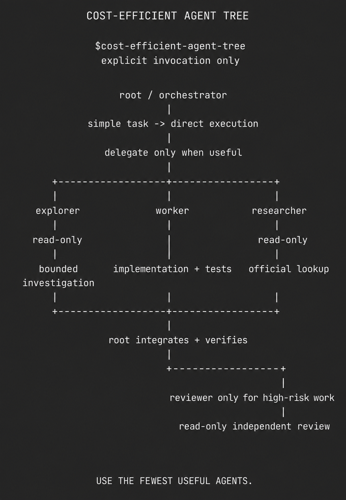

# 安装方式与插件清单

## 安装脚本

执行前可查看 [PowerShell 脚本](../install.ps1)或 [Shell 脚本](../install.sh)。脚本检查 `codex` 命令，添加或更新 Marketplace 后安装插件。

Windows PowerShell：

```powershell
irm https://raw.githubusercontent.com/DUSK1NG/cost-efficient-agent-tree/main/install.ps1 | iex
```

实际安装完成提示：

```text
安装完成。请重启 Codex 并新建对话，然后明确使用 $cost-efficient-agent-tree。
```

Shell 环境使用仓库中的 `install.sh`，要求 `codex` 已在 PATH 中；系统与终端须支持脚本使用的标准 Shell 命令。

## 本地目录安装

从[发布页](https://github.com/DUSK1NG/cost-efficient-agent-tree/releases/latest)下载 ZIP 并完整解压，在其根目录执行：

```powershell
codex plugin marketplace add .
codex plugin add cost-efficient-agent-tree@cost-efficient-agent-tree-local
```

输出包含：

```text
Added plugin `cost-efficient-agent-tree` from marketplace `cost-efficient-agent-tree-local`.
```

也可将完整 ZIP 附件交给 Codex，要求它先检查 README 与清单，再添加包内 Marketplace 并安装插件。安装后检查策略为 `allow_implicit_invocation: false`，重启并在新对话中明确调用 Skill。

## 清单与来源

Marketplace 声明位于 [.agents/plugins/marketplace.json](../.agents/plugins/marketplace.json)，插件元数据位于 [plugin.json](../plugins/cost-efficient-agent-tree/.codex-plugin/plugin.json)，工作规则与调用策略位于 [Skill 目录](../plugins/cost-efficient-agent-tree/skills/cost-efficient-agent-tree/)。

原始构想与图示作者：[Voxyz（@Voxyz_ai）](https://x.com/Voxyz_ai)。本仓库由 DUSK1NG 面向 Codex 非官方适配，与原作者不存在隶属或背书关系。


